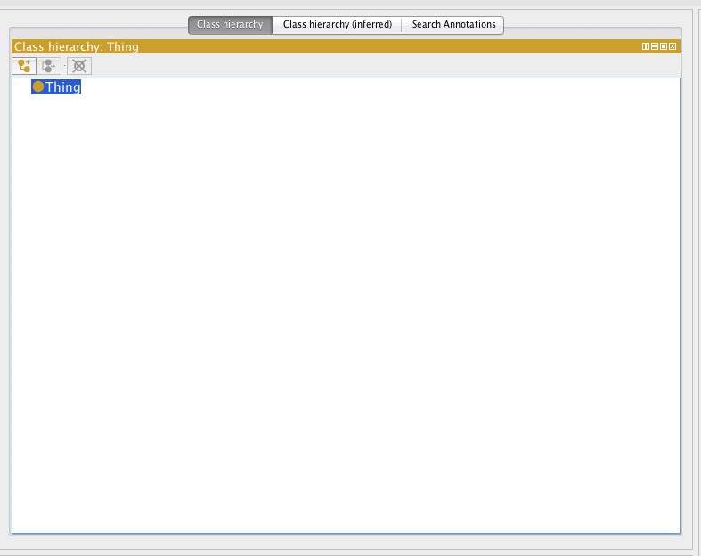
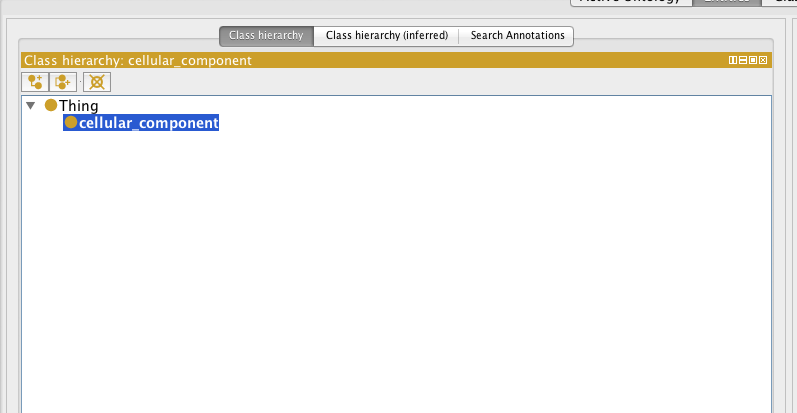
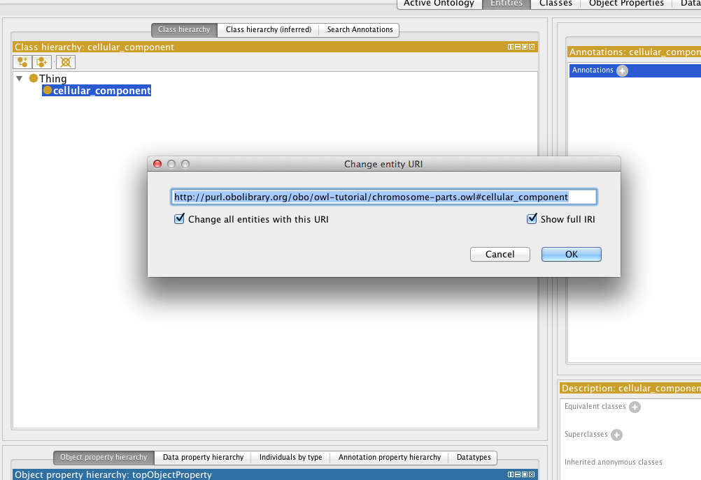
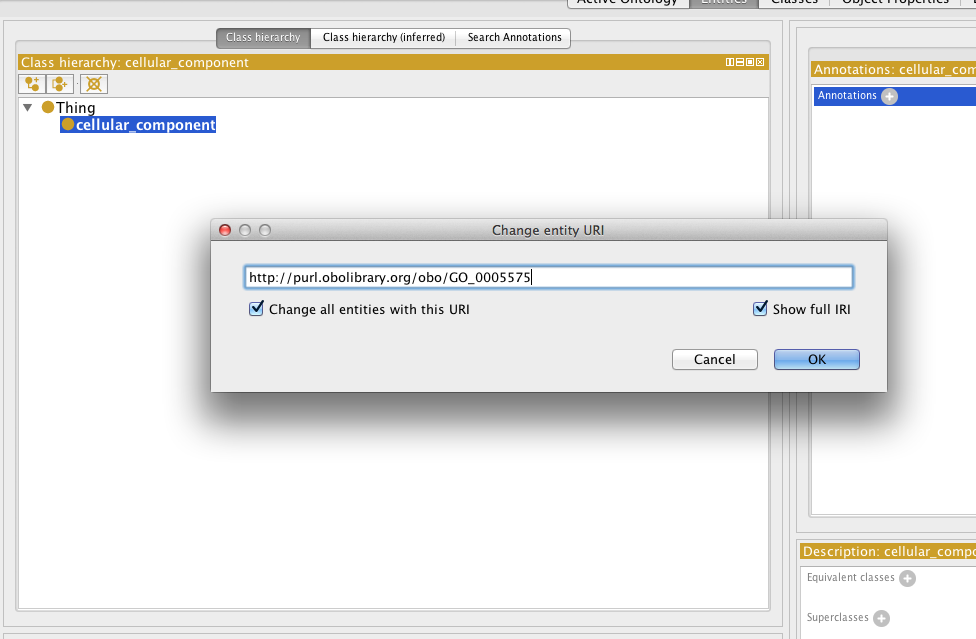
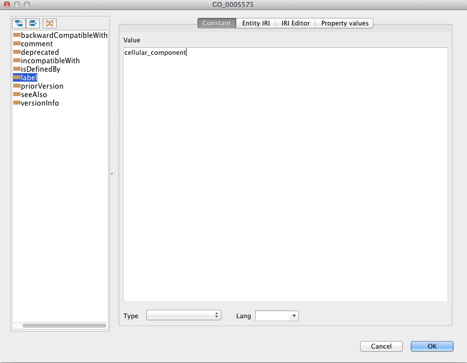
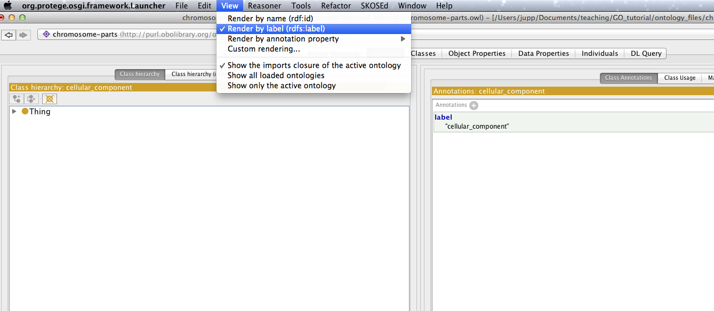
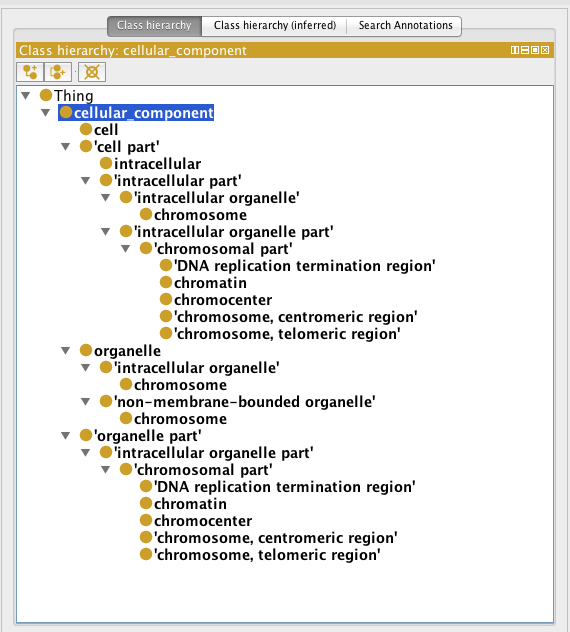

The entities tab
================

You will see along the top of the screen various tabs. Each tab provides a different perspective on the ontology. For example, the classes tab allows us to view and edit the classes in the ontology, and similarly the properties tab focuses on the properties in the ontology. The primary tab where you will spend most of your time is the entities tab.

Select the entities tab and then select the Thing class. Thing is the root class for all OWL ontologies and it cannot be deleted in Protégé.

The entities tab is split into two halves. The left hand side provides a suite of panels for selecting various entities in your ontology. When a particular entity is selected the panels on the right hand side displays information about that entity. The entities panel is context specific, so if you have a class selected (like Thing) then the panels on the right are aimed at editing classes.

If you select the topObjectProperty property in the panel at the bottom, the right hand side panels will change context.

Creating your first class
-------------------------

By far the most common panel for working with your ontology is the Class hierarchy panel.

There are three buttons at the top of the class hierarchy view. These allow you to add a subclass, add a sibling or delete a selected class. We will use the 'add subclass' button to add a child class to OWL thing. For now, simply name this class cellular\_component.

The class should have been created as follows. By default Protégé will use the ontology IRI, followed by a \#, followed by your specified name (replacing spaces with underscores) as the the unique IRI for this entity. If you hover over this class with your mouse you will see the full IRI for this class

Renaming an entity
------------------

We can change the IRI for a concept using the rename function in the refactoring menu. Rename the cellular\_component class to use its proper IRI from the Gene Ontology (<http://purl.obolibrary.org/obo/GO_0005575>)

Make sure the check the “Show full IRI” box so you can edit the full IRI.

And then paste or type in the correct GO URI.

Now the correct GO URI appears in the ontology. Obviously you don’t want to have to rename every entity you create when building your own ontology. Luckily Protégé provides a “New Entities” preferences panel where you can specify how new IRI should be created.

New entities
------------

Terms in the ontologies we use have separate names and IDs. The names are annotation values (labels) and the IDs are represented using IRIs. The [OBO foundry has a policy on IRI](http://www.obofoundry.org/id-policy.shtml) (or ID) generation. You can set an id strategy using the “New Entities” tab under the Protégé preferences.

Set your new entity preferences as follows:

For ontologies other than GO, change the value of the prefix. Note that all OBO library ontologies should use the obolibrary.org Specified URI value.

Adding annotations properties
-----------------------------

You can add annotations (such as labels, descriptions, xrefs, etc.) to any OWL entity using Protégé. The panel on the right, named Annotations is where these annotations are added. Use this panel to add a “cellular\_component” label to the class you created previously.

Select the + button to add an annotation to the selected entity. Protégé has a set of built in annotation properties, such as label and comment – add a comment such as “created during Berkeley tutorial”. You can also create your own annotation properties.

Note that for practical purposes you will start from an existing OWL file that will include a pre-declared set of annotation properties such as ‘has exact synonym’ and ‘definition’. You may never need to create your own annotation properties.

Setting label rendering
-----------------------

You can change how Protégé renders entities. It is common to want to view entities by the their label, rather than identifiers. You can tell Protégé to render on any annotation property you choose. Lets render all entities by their class label.

In the view menu choose render by label

The cellular\_component class will now render in the hierarchy view using the value of the label annotation property.

Creating the class hierarchy
----------------------------

We will now create a simple class hierarchy. In Protégé ‘class hierarchy’ typically refers to a sub/superclass hierarchy (also known as an is\_a hierarchy in OBO-Edit). We will return to relations such as ‘part of’ later on in this tutorial. For now, we will take advantage of the fact that the GO cell component ontology allows us to bypass this for now by means of classes such as ‘cell part’ and ‘nuclear part’.

Using the class hierarchy view create a small section of the cellular component branch of the GO as shown in the following screenshot. Play around with add subclass, add sibling and the drag and drop functionality.

Don’t bother to add textual definitions, synonyms, etc. at this stage.

After you have become familiar, you can save your efforts or discard them – you won’t need this ontology from here on.

## EXERCISE: Basic Subclass Hierarchy

Go to the directory [basic-subclass](https://github.com/geneontology/protege-tutorial/tree/master/basic-subclass) in the tutorial folder and open chromosome-parts.owl

Follow the instructions in the README file
