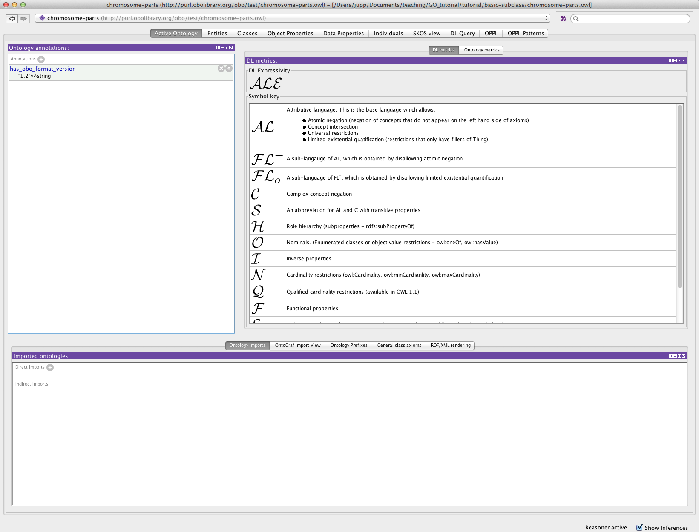
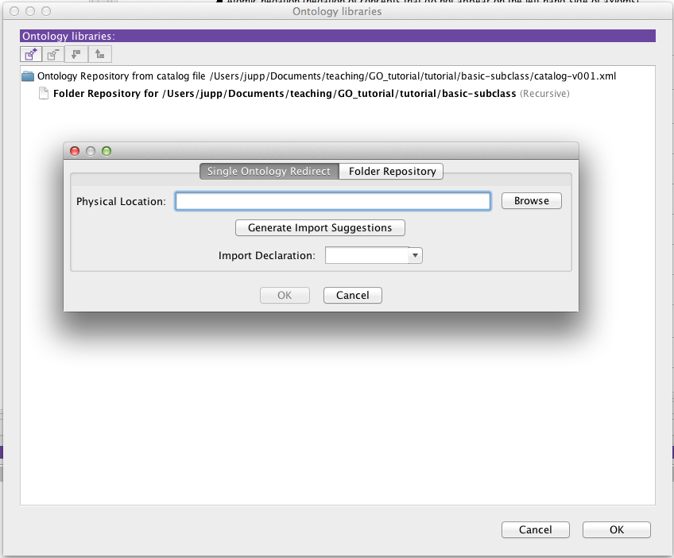

Imports
=======

OWL ontologies may import one or more other OWL ontologies. Ontology imports are managed using the ontology URI (or IRI). Protégé allows you to import ontologies from both the web and your local files system. The imports panel is found in the Active Ontology tab by default.

When a file is imported into an ontology, only the IRI of the imported ontology is stored. Protégé uses the IRI to try and locate the imported ontology the next time you open the file in Protégé. Most OBO ontologies have an IRI that will refer to document via a URL on the web e.g. The Gene ontology IRI is <http://purl.obolibrary.org/obo/go.owl>[4] . Navigating to this URL in a web browser will retrieve the latest gene ontology. If your ontology imports an ontology that does not resolve to a web URL, or you are not connected to the internet, then Protégé will prompt you to resolve the ontology IRI to a file on your system.

Some examples of imports can be found in

<http://wiki.geneontology.org/index.php/Ontology_extensions>

## EXERCISE: response to stimulus

Go to the [response-to-stimulus](https://github.com/geneontology/protege-tutorial/tree/master/response-to-stimulus) directory and follow the README.txt

This example makes use of a small ontology called STIMO – the stimulus ontology.

Ontology libraries 
-------------------

Having to wait for Protégé to download ontologies from the web can be rather time consuming, so luckily Protégé has a mechanism for you define ontology libraries that enable you to store mapping between ontology IRIs and files on your filesystem. You can create edit your ontology library in the File -&gt; Edit ontology libraries… menu item.

========================

Ontology libraries are stored in a file on your system called catalog-001.xml. When you start working with protégé you will begin to notice many of these files cropping up on your file system. Chose a catalog-001.xml file to edit and add ontology files to your library.

Catalog files
-------------

TODO
